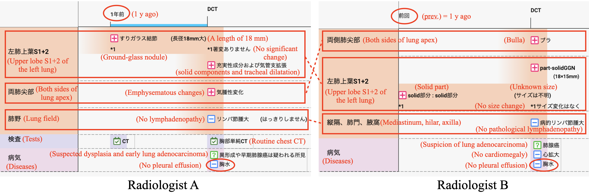
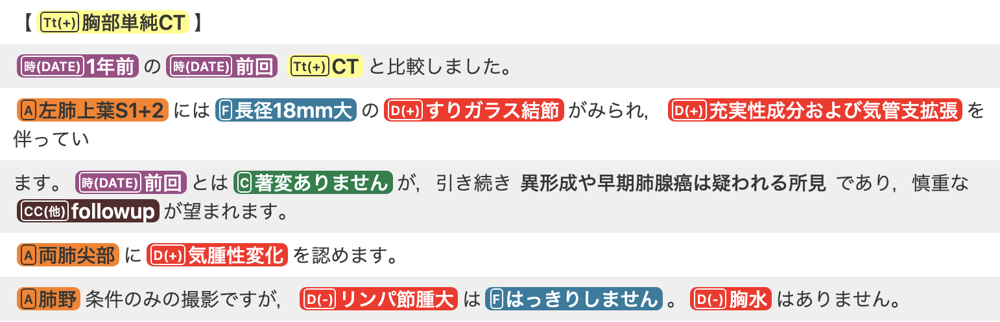
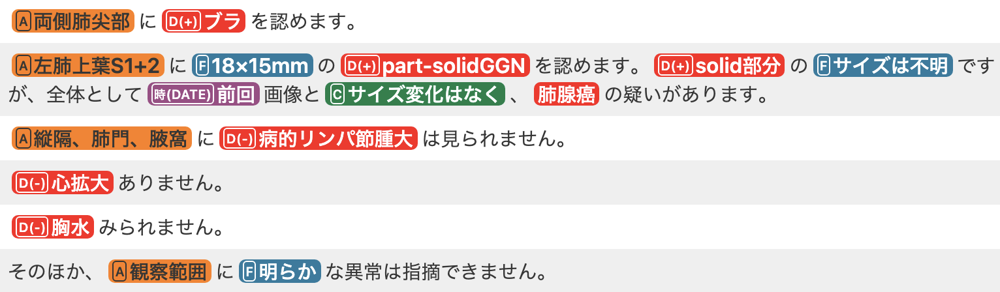
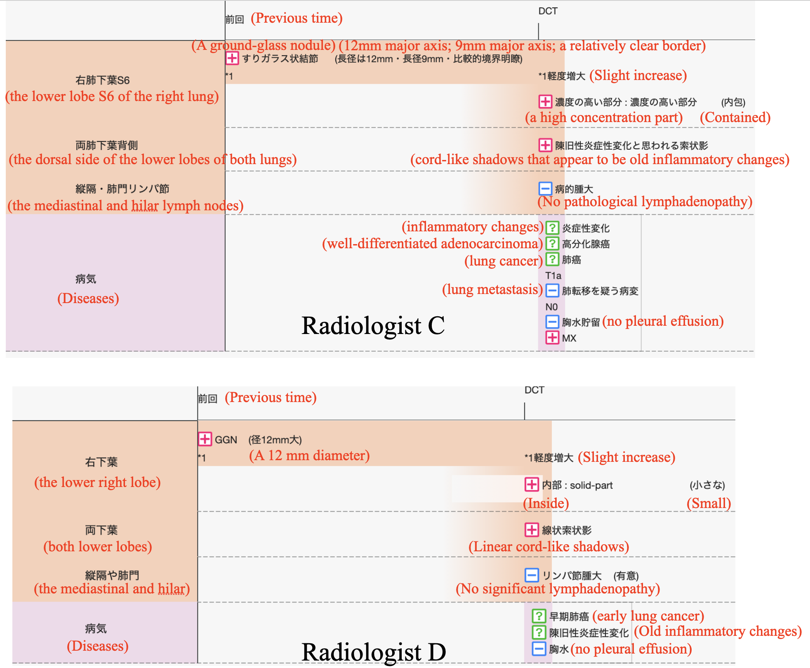
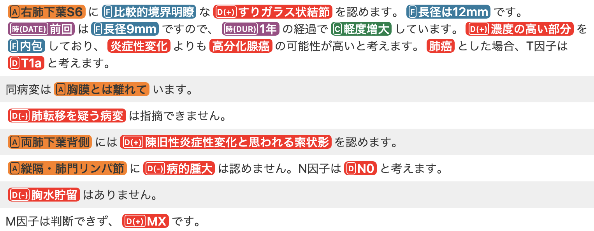

# Coherence check

## Case (i)

This is the case we reported in the submitted paper.

### Setup

The second image ("CT Chest (one year later)") of [Adenocarcinoma in situ of lung](https://radiopaedia.org/cases/adenocarcinoma-in-situ-of-lung-1) at Radiopaedia with the following instructions:

- 74-years-old woman
- No episodes
- One-year-later follow-up of a lung nodule
- The pathological change has the length of 18 mm with an unknown size of the solid part inside

### Generated timeline comparison

### Radiologist A's report

#### English translated version (without NER)

> [Routine chest CT]
> Comparison with the previous CT one year ago was done. 
> Upper lobe S1 + 2 of the left lung has a large ground-glass nodule with a length of 18 mm, accompanied by solid components and tracheal dilatation. Although it is not significantly different from the previous time, dysplasia and early lung adenocarcinoma are still suspected, and careful follow-up is desired. 
> Emphysematous changes are observed in both lung apex. 
> Only the lung field conditions were taken, but the size of the lymph node tumour is not clear. No pleural effusion. 

### Radiologist B's report

#### English translated version (without NER)

> Bulla are seen on both sides of the lung apex. 
> 18 × 15 mm part-solid GGN is seen in the upper lobe S1 + 2 of the left lung. The size of the solid part is unknown, but as a whole, there is no size change from the previous image, and there is a suspicion of lung adenocarcinoma. 
> No pathological lymphadenopathy is seen in the mediastinum, hilar, or axilla. 
> There is no cardiomegaly. 
> No pleural effusion seen. 
> In addition, no obvious abnormality can be pointed out in the observation range. 

## Case (ii)

This is the additional case we mentioned but did not report in the submitted paper.

### Setup

The third image ("CT Chest (current)") of [Minimally invasive adenocarcinoma of the lung](https://radiopaedia.org/cases/minimally-invasive-adenocarcinoma-of-the-lung-1) at Radiopaedia with the following instructions:

- 50-years-old woman
- No episodes
- One-year-later follow-up of a lung nodule
- The entire length of the pathological change is 12 mm, which is increased from 9 mm one year ago

### Generated timeline comparison

### Radiologist C's report

#### English translated version (without NER)

> A ground-glass nodule with a relatively clear border is seen in the lower lobe S6 of the right lung. The major axis is 12 mm. Since the major axis was 9 mm the last time, it has increased slightly over the course of one year. It contains a high concentration part, there is a higher possibility of well-differentiated adenocarcinoma than inflammatory changes. Assuming it is lung cancer, the T factor is considered to be T1a. 
> The lesion is detached from the pleura. 
> Lesions suspected of lung metastasis cannot be identified. 
> On the dorsal side of the lower lobes of both lungs, cord-like shadows that appear to be old inflammatory changes are seen. 
> No pathological swelling is seen in the mediastinal or hilar lymph nodes. The N factor is considered to be N0. 
> There is no pleural effusion. 
> The M factor cannot be determined and is MX. 

### Radiologist D's report 

#### English translated version (without NER)

> A 12 mm diameter GGN is seen in the lower right lobe and is visible with a small solid part inside. It has increased slightly compared to the previous time, and there is a possibility of early lung cancer. 
> Linear cord-like shadows are seen in both lower lobes, and old inflammatory changes are suspected. 
> No significant mediastinum or hilar lymphadenopathy seen. 
> No pleural effusion. 