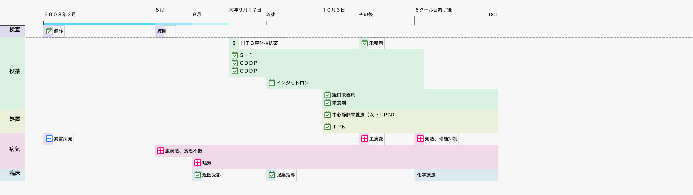
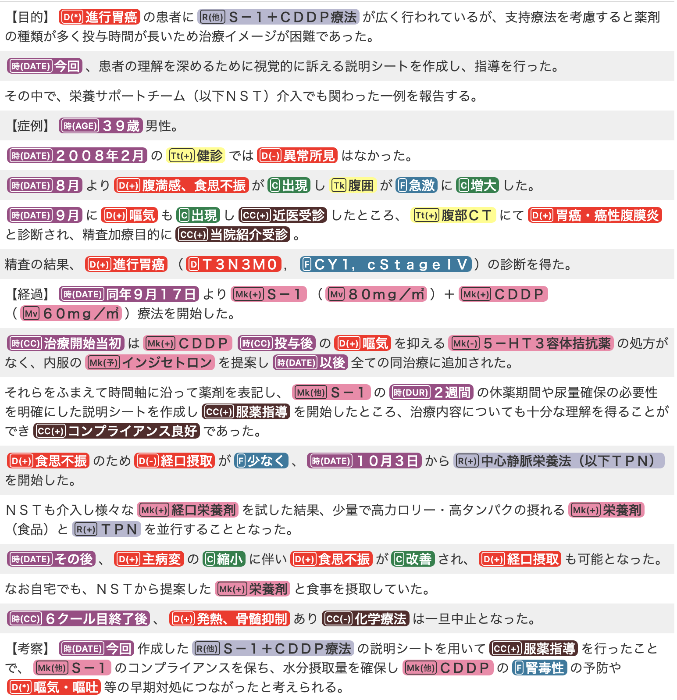
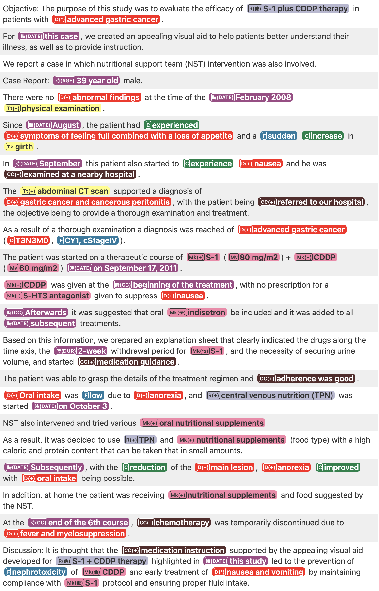
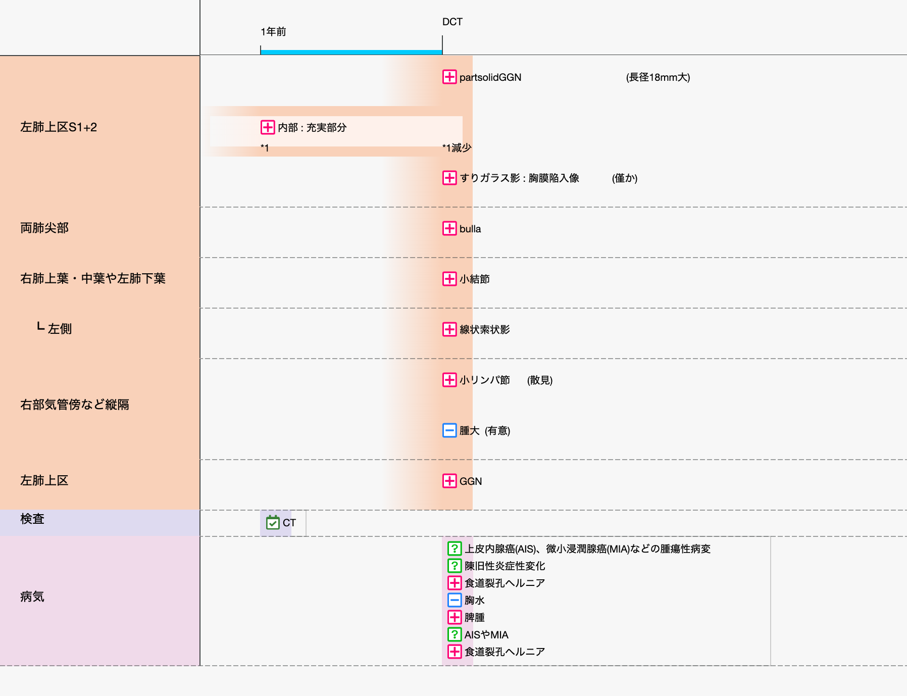
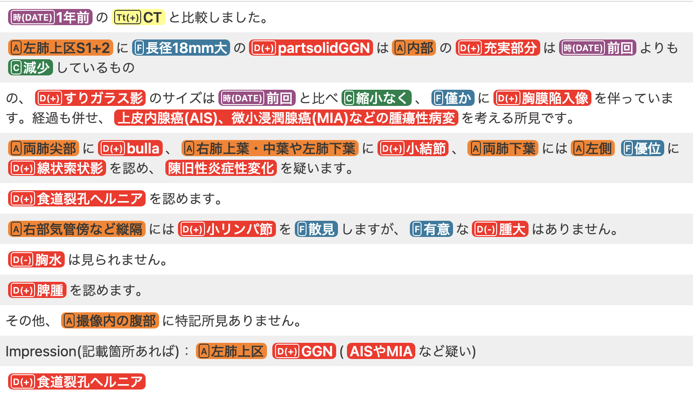

# Precision check

This is a detailed report of our precision check evaluation to Health Record Timeliner (HeaRT), as a supplemental report for our article submitted to MEDINFO 2021.

## Evaluation Points

- whether the entities are located at the right time point (**OnSet**)
- whether the entities span the right duration when they exist or are applied (**Duration**)
- whether the changes happening to diseases are described correctly (**ChangeInfo**)

## Raw Results

### Case Report

#### HeaRT visualisation

#### Input document (NER-ed)

##### Japanese original case report

##### English translated version

#### Precision checks

No ChangeInfo evaluation was conducted because this document does not contain any Change information related to diseases.

| Entity | OnSet | Duration | Comments |
| ---- | ----- | -------- | ------- |
| 検診 (physical examination) | ○ | ○ | |
| 腹囲 (girth) | ○ | ○ | |
| CDDP | ○ | ○ | Until the end of the 6th school year |
| 栄養剤 (nutritional supplements) | ○ | ○ | Acceptable due to no clear statement |
| S-1 | ○ | ○ | Until the end of the 6th school year |
| CDDP | ○ | ○ | Until the end of the 6th school year (identical to the entity "CDDP" above)|
| 5-HT3受容体拮抗薬 (-- antagonist) | × | × | |
| インジセトロン (indisetron) | ○ | ○ | Acceptable due to no clear statement |
| 経口栄養剤 (oral nutritional supplements) | ○ | ○ | Acceptable due to no clear statement |
| 栄養剤 (nutritional supplements) | ○ |  ○ | Acceptable due to no clear statement |
| 中心静脈栄養法（以下TPN） (central venous nutrition; TPN) | ○ | ○ | Acceptable due to no clear statement |
| TPN | ○ | ○ | Acceptable due to no clear statement (identical to the entity right above) |
| 異常所見 (abnormal findings) | ○ | ○ | |
| 嘔気 (nausea) | ○ | ○ | Acceptable due to no clear statement |
| 主病変 (main lesion) | ○ |  ○ |  |
| 発熱、骨髄抑制 (fever and myelosuppression) | ○ | ○ | |
| 腹満感、食思不振 (symptoms of feeling combined with a loss of appealing) | ○ | ○ | Acceptable due to no clear statement |
| 嘔気 (nausea) | ○ | ○ | Acceptable due to no clear statement |
| 近医受診 (examined at a nearby hospital) | ○ | ○ | |
| 服薬指導 (medication instruction) | ○ | ○ | |
| 化学療法 (chemotherapy)                                      | ×     | ×        |  |

### Radiology Report

#### HeaRT visualisation

#### Input document (NER-ed)

##### Japanese original radiology report

##### English translated version

We do not have an English-translated version that retains NER tags; the raw English translation is below:

> Comparison with CT from 1 year ago. In the left lung upper section S1 + 2, the part solid GGN with a large diameter of 18 mm has a smaller internal solid part than the previous time, but the size of the ground-glass shadow has not shrunk compared to the previous time, and is accompanied by a slight pleural invagination. Neoplastic lesions such as adenocarci-noma in situ (AIS) and minimally invasive adenocarcinoma (MIA) should be considered. Bulla are seen at the apex of both lungs, nodules are seen in the upper and middle lobes of the right lung and the lower lobe of the left lung, and linear cord-like shadows are seen predominantly on the left side of the lower lobes of both lungs. Hiatal hernia is seen. Small lymph nodes are scattered in the mediastinum, such as near the right trachea, but there is no significant swelling. No pleural effu-sion is seen. Splenomegaly is seen. There are no other find-ings in the abdomen during imaging. Impression (if any): Left lung upper section GGN (suspected AIS, MIA, etc.), Oesoph-ageal hiatus hernia

#### Precision checks

| Entity | OnSet | Duration | ChangeInfo | Comments |
| ---- | ----- | -------- | ---------- | ----------- |
| partsolidGGN | × | ○ | | |
| 内部、充実部分 (an internal solid part) | ○ | ○ | ○ | |
| すりガラス影、胸膜陥入像 (ground-glass shadow accompanied by a slight pleural invagination) | × | ○ | × | "has not shrunk compared to the previous time" |
| bulla | ○ | ○ | | |
| 小結節 (nodules ) | ○ | ○ | | |
| 線状索状影 (linear cord-like shadows) | ○ | ○ | | |
| 小リンパ節 (Small lymph nodes) | ○ | ○ | | |
| 腫大 (significant swelling) | ○ | ○ | | |
| GGN | ○ | ○ | | |
| CT | ○ | ○ | | |
| 上皮内腺癌（AIS）、微小浸潤腺癌（MIA）などの腫瘍性病変 (Neoplastic lesions such as adenocarcinoma in situ (AIS) and minimally invasive adenocarcinoma (MIA)) | ○ | ○ | | |
| 陳旧性炎症性変化 (old inflammatory changes)| ○ | ○ | | |
| 食道裂孔ヘルニア (Hiatal hernia)| ○ | ○ | | |
| 胸水 (pleural effusion) | ○ | ○ | | |
| 脾腫 (Splenomegaly) | ○ | ○ | | |
| AISやMIA (AIS and MIA) | ○ | ○ | | |
| 食道裂孔ヘルニア (Hiatal hernia) | ○ | ○ | | |

## Summarised Result

This table is identical to Table 1 in the article.

| | OnSet | Duration | ChangeInfo |
| :--: | :--: | :--: | :--: |
| Case report | 18/20 (90.0%) | 18/20 (90.0%) | — |
| Radiology report | 15/17 (88.2%) | 15/15 (100%) | 1/2 (50.0%) |